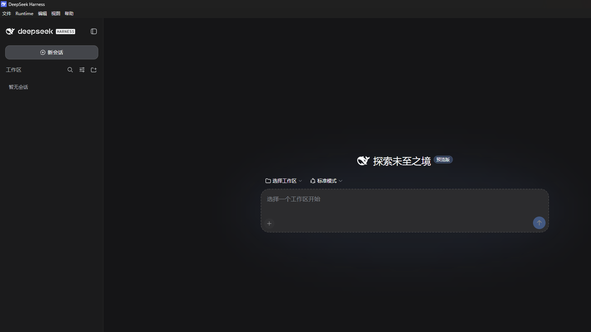
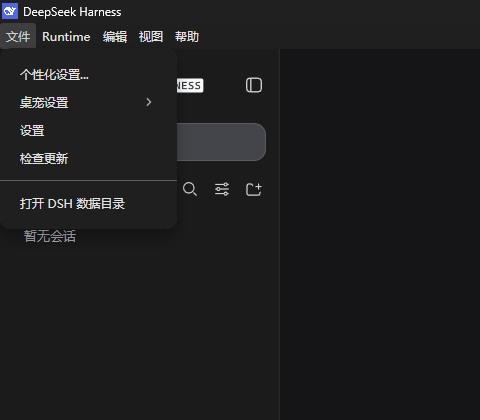
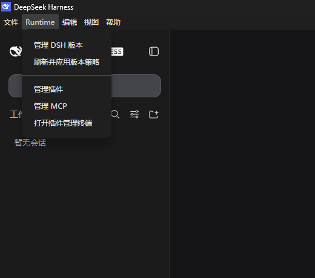
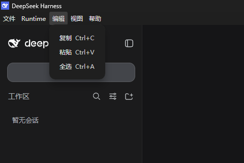
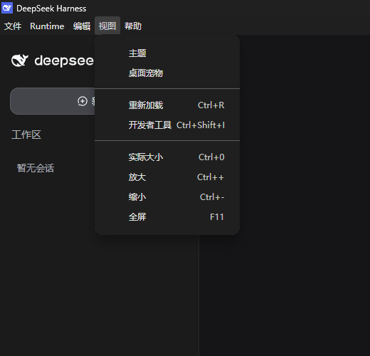
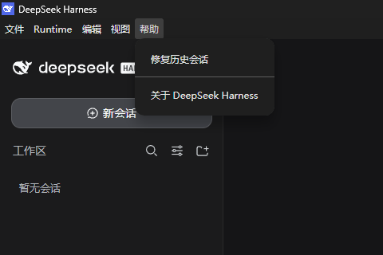

# DeepSeek Harness Desktop

中文 | [English](README.en.md)

DeepSeek Harness Desktop 是 [DeepSeek Harness](https://github.com/deepseek-ai/deepseek-harness) 的 Windows 桌面客户端。它负责安装和切换 DSH Runtime，并补充版本、插件、MCP、个性化、桌面宠物、更新与故障恢复等原生桌面入口。

普通使用不需要单独安装 Node.js、pnpm 或 Git。当前仅支持 Windows x64。



## 下载与首次启动

1. 从 [Latest Release](https://github.com/ToxicantX/deepseek-harness-desktop/releases/latest) 下载 Windows x64 安装器或 portable 版本。
2. 启动应用。第一次启动需要联网，Shell 会自动下载并校验最新兼容的 DSH Runtime。
3. 等待主界面出现后，选择或创建工作区，再开始新会话。
4. 后续启动会直接复用已安装的 Runtime；更新 Shell 或切换 Runtime 不会删除会话、设置和插件。

Runtime 下载、校验或启动失败时，应用会保留原有可用版本，并在启动页显示诊断与可执行的恢复操作。

## 关联插件

以下插件可以扩展 DeepSeek Harness Desktop 的使用场景。在 **Runtime → 管理插件** 中粘贴仓库地址即可安装或更新：

| 插件 | 用途 |
| --- | --- |
| [dsh-channel-telegram](https://github.com/ToxicantX/dsh-channel-telegram) | 将 DSH 会话接入 Telegram 私聊、QQ 官方机器人 C2C 消息和微信 iLink 私聊，并复用同一套 Host、项目与会话选择流程。 |
| [dsh-multi-model-orchestrator](https://github.com/ToxicantX/dsh-multi-model-orchestrator) | 为 DSH 增加多模型 Agent 编排，可配置最多 3 个专家 Agent，由主 Agent 按职责委派非重叠任务。 |

```text
https://github.com/ToxicantX/dsh-channel-telegram
https://github.com/ToxicantX/dsh-multi-model-orchestrator
```

安装完成后，Desktop 会自动重启 Runtime；刷新页面后可在 DSH Web 设置中完成插件配置。

## 菜单使用说明

### 文件



- **个性化设置...**：编辑全局 `$DSH_HOME/AGENTS.md`，用于记录语言、输出风格和协作偏好。保存前会检查外部修改；不要在其中填写 API Key、Token 或密码。
- **桌宠设置**：在“小 / 标准 / 大”三档之间调整桌面宠物大小。
- **设置**：打开 DSH Web 设置页。只有 Runtime 已就绪时可用。
- **检查更新**：立即检查 Desktop Shell 更新；DSH Runtime 版本由 Runtime 菜单单独管理。
- **打开 DSH 数据目录**：打开会话、配置、凭据引用和插件所在的数据目录，默认是 `%USERPROFILE%\.dsh`。

### Runtime



- **管理 DSH 版本**：在“自动选择最新兼容版本”和“固定版本”之间切换，并查看当前使用的版本。
- **刷新并应用版本策略**：重新读取 Runtime Catalog，按当前策略下载、切换或重启 Runtime。
- **管理插件**：安装、更新或移除当前 Web Profile 的插件，并查看操作进度与日志。
- **管理 MCP**：搜索本机 MCP、查看配置来源和 DSH 接入状态，并启用或禁用可管理的条目。
- **打开终端**：为高级用户打开已配置好 Node、pnpm 和 `dsh` 命令的终端。

插件或 MCP 发生变更时，Shell 会先停止 Runtime，完成原子修改后再自动启动，避免 Web 在依赖变更过程中读取不完整文件。

### 编辑



- **复制 / 粘贴 / 全选**：作用于当前获得焦点的输入框、编辑器或页面内容。
- 对话输入框还支持右键菜单中的撤销、重做、剪切、删除等原生编辑操作。
- 可直接粘贴长文本和文本文件；具体规则见下方“文本与文件粘贴”。

### 视图



- **主题**：打开 DSH 主题入口。Runtime 就绪后可用。
- **桌面宠物**：显示或隐藏桌宠；状态会保留到下次启动。
- **重新加载**：刷新当前 DSH Web 页面，不会删除会话或配置。
- **开发者工具**：打开 Electron DevTools，主要用于排查页面问题。
- **实际大小 / 放大 / 缩小 / 全屏**：调整界面缩放或切换全屏显示。

### 帮助



- **修复历史会话**：输入会话 ID 后先进行诊断，核对异常区间、事件保留状态和备份位置，再确认修复；修复后可从备份回滚。
- **关于 DeepSeek Harness**：查看 Desktop Shell、当前 DSH Runtime 和 Runtime Revision 等版本信息。

## 常用功能

### 文本与文件粘贴

- 超过 500 字符的纯文本和可读取的文本文件会先显示为待发送附件，可预览、移除或展开，提交消息时才写入会话。
- 2 MB 以内的文本文件以内联上下文发送；更大的文本文件只发送所选绝对路径和分段读取说明。
- 单次最多处理 32 个文本文件，内联文本总量上限为 8 MB。
- 图片、音视频、压缩包、PDF、Office 文档及其他二进制内容继续由 DSH Web 处理。

### Agent 个性化

**文件 → 个性化设置...** 管理全局用户偏好。装配了 `@deepseek-ai/dsh-agent-instructions` 的 Agent 预设会在后续新会话中加载该文件，同时继续遵从预设自身的角色、工具、能力和安全边界。项目目录中的 `AGENTS.md` 可以添加更具体的项目规则。

保存使用同目录临时文件原子替换；若文件已被其他程序修改，会要求重新加载后再保存。保存空白内容会移除该文件。

### 桌面宠物与托盘

桌宠使用本地透明 PNG 表达待机、思考、说话、审批、成功、错误、不可用和拖动状态，不加载网络图片。Windows 启用“减少动态效果”时会停在代表帧。

- 左键桌宠：打开主窗口。
- 右键桌宠：打开主窗口、调整大小或隐藏桌宠。
- 回复气泡：流式回复结束后保留 5 秒；审批气泡会持续到请求被处理。
- 系统托盘：可显示主窗口、启用或关闭桌宠，以及完全退出应用。

### 插件管理

在 **Runtime → 管理插件** 中输入 npm 包名、GitHub HTTPS 地址或 `github:` spec，例如：

```text
@scope/plugin@1.2.3
https://github.com/owner/repo.git
github:owner/repo
```

Registry 插件在检测到兼容新版本时显示更新按钮；GitHub、git、link、file 和 workspace 来源提供手动更新。若插件导致 DSH 无法启动，Shell 自带的插件管理器仍可独立打开，用于移除或更新问题插件。

高级用户也可以在 **Runtime → 打开终端** 中使用：

```powershell
dsh plugin --profile web list
dsh plugin --profile web add <package-spec>
dsh plugin --profile web update <package-spec>
dsh plugin --profile web remove <package-name>
```

只有 Git 来源需要系统 `PATH` 中存在 Git；npm、本地目录和 tarball 不要求全局安装 Node.js 或 pnpm。

### MCP 管理

**Runtime → 管理 MCP** 会按实际 Cordis Patch 顺序读取 Web Profile Bundle、Profile Patch、`$DSH_HOME/cordis.patch.yml` 和 Desktop Runtime Overlay，并只读发现 `%USERPROFILE%\.codex\config.toml` 中的本机 MCP。

- 搜索名称、Provider 或地址，并按 DSH 接入状态筛选。
- 环境变量与 HTTP Header 只显示键名；URL 凭据、查询参数和疑似密钥参数不会发送到管理窗口。
- 开关只修改 DSH 侧的 `disabled` 覆盖，不会改写 Codex `config.toml` 或 MCP Server 文件。
- 被更高优先级 Runtime Overlay 锁定或使用动态 `!!js` 状态的条目只能查看，不能从低优先级配置切换。

## 数据位置与安全边界

| 内容 | 默认位置 |
| --- | --- |
| DSH Runtime | `%LOCALAPPDATA%\DeepSeek Harness\runtime-manager\runtimes\<dsh-version>` |
| 会话、设置、插件和用户配置 | `%USERPROFILE%\.dsh` |
| 全局 Agent 个性化 | `%USERPROFILE%\.dsh\AGENTS.md` |

设置 `DSH_HOME` 后，用户数据位置会随之改变。切换 Runtime、更新 Shell 或重新安装不会主动删除该目录。

启动恢复功能只处理与诊断精确匹配的失效插件、Bundle 或预设条目；操作前会备份并检查 revision，不会清空整个 Profile、会话、设置或凭据。诊断模糊、配置已变化或校验失败时会停止操作。

## 常见问题

### 第一次启动一直停在下载或启动页

确认能够访问 GitHub Release。应用需要下载 Runtime Catalog 和 Windows x64 Runtime ZIP，并验证文件大小与 SHA-256；网络中断不会覆盖已有可用 Runtime。

### 某个插件导致 Runtime 无法就绪

从启动页或 **Runtime → 管理插件** 移除、更新该插件，然后重新启动 Runtime。不要直接删除整个 `%USERPROFILE%\.dsh`。

### 旧会话无法打开

使用 **帮助 → 修复历史会话** 先诊断。只有在工具确认可保留全部事件并给出备份位置后，再勾选确认并执行修复。

### Windows 显示“未知发布者”或 SmartScreen 提示

未签名构建或尚未积累信誉的新证书都可能触发提示。请只从本仓库的 [Latest Release](https://github.com/ToxicantX/deepseek-harness-desktop/releases/latest) 下载，并在运行前核对发布来源。

## Code signing policy

SignPath Foundation 批准并启用集成后，符合条件的 Shell Release 将使用 [SignPath.io](https://about.signpath.io) 提供的免费代码签名，证书由 [SignPath Foundation](https://signpath.org) 持有。集成启用前的发布和本地构建可能仍未签名；每个文件应以 Windows 显示的实际签名状态为准。

签名只覆盖由本仓库 GitHub Actions 从公开源码构建的 Desktop Shell 产物，不用于 Runtime 压缩包或上游项目二进制。团队角色、隐私声明、审批规则和验证方式见[完整代码签名政策](docs/code-signing-policy.md)。

## 版本与更新说明

- **Shell Version**：桌面窗口、下载器、版本管理器和 Runtime 协议的版本。
- **DSH Version**：对应上游 `dsh-v*` Git Tag。
- **Runtime Revision**：同一 DSH Version 的不可变桌面构建修订。
- 默认策略是 `latest-compatible`，只选择已有预构建产物且兼容当前 Shell 的最高版本。
- `shell-v*` Release 发布 Desktop Shell；`runtime-dsh-v*-desktop.<revision>` 发布 Runtime；`runtime-catalog` 提供机器可读目录。

上游刚发布但尚未完成桌面构建与冒烟验证的版本不会进入 Catalog，因此不会自动替换现有 Runtime。

## 开发者说明

需要 Windows x64、Node.js 24 和 pnpm 11：

```powershell
pnpm install --frozen-lockfile
pnpm test
pnpm run typecheck
pnpm run build
pnpm run start
pnpm run dist
```

构建完整 Runtime：

```powershell
./scripts/build-runtime.ps1 `
  -DshTag dsh-v0.1.0-rc.7 `
  -OutputDirectory "$PWD/runtime-output" `
  -RuntimeRevision 1 `
  -RequiredShellRange '>=0.1.0 <1.0.0'
```

`.github/workflows/runtime-release.yml` 会验证上游 Tag 与 CLI 版本，安装精确的官方 `@deepseek-ai/dsh`、Node 24 和独立 pnpm，运行真实 Web、设置打开、会话修复、插件及关闭冒烟，再发布 ZIP、Manifest 和 Catalog 更新。同一 DSH Version 只能以更高 Runtime Revision 更新。

公开分发应使用 Windows 信任 CA 签发的 Authenticode 证书。`shell-v*` Tag 构建可通过 `CSC_LINK` 和 `CSC_KEY_PASSWORD` 交给 electron-builder 签名；硬件或云端保护的私钥应接入对应远程签名服务，不应复制到仓库或 GitHub Secret。没有证书时，本地 `dist` 保持未签名。

## 当前范围

- 仅支持 Windows x64。
- 当前 Shell 最低兼容 DSH Version 为 `0.1.0-rc.7`。
- Runtime Release 始终标记为 GitHub Prerelease，不会替换 electron-updater 使用的 Shell Latest Release。
- DSH Web 只通过临时 loopback Origin 打开；Host 与插件运行在下载的标准 Node Runtime 中。
